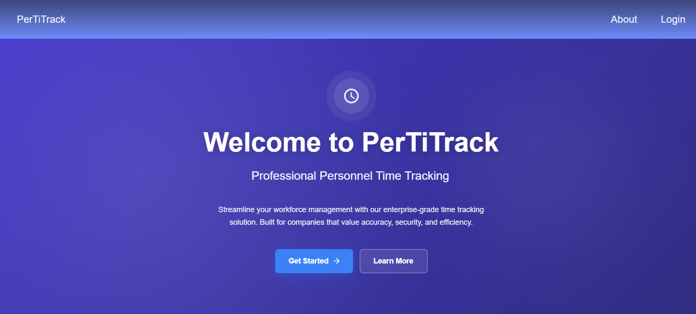
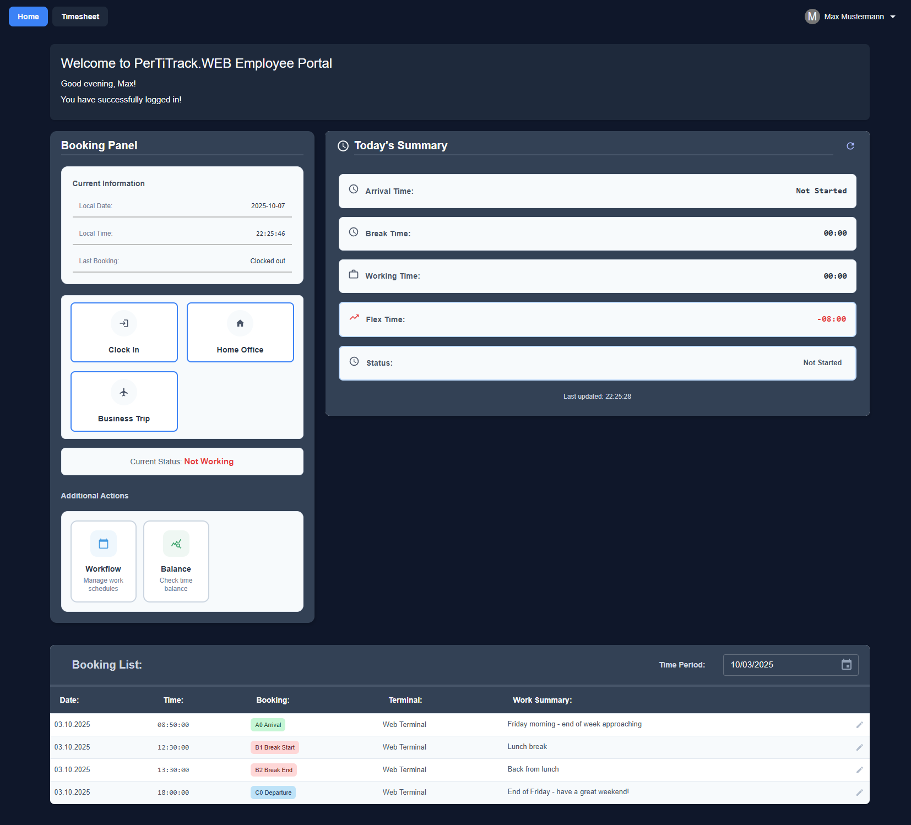

# PerTiTrack - Personnel Time Tracking System

[](https://www.oracle.com/java/)
[](https://spring.io/projects/spring-boot)
[](https://reactjs.org/)
[](https://www.typescriptlang.org/)
[](https://www.postgresql.org/)
[](https://opensource.org/licenses/MIT)

> **Capstone Project** - [Neue Fische Java Development Bootcamp](https://www.neuefische.de/bootcamp/java-development)

A comprehensive, enterprise-grade web application for managing employee time tracking, absence requests, and workforce analytics. Built with modern technologies and best practices for scalability, security, and maintainability.

## Live Demo

### **[Try PerTiTrack Live](https://www.pertitrack.denizaltun.de/)**

### Demo Credentials
- **Demo credentials and instructions are here:** [ReadMe-Demo](docs/README-DEMO.md)

---

## Table of Contents

- [Features](#features)
- [Tech Stack](#tech-stack)
- [Architecture](#architecture)
- [Getting Started](#getting-started)
- [API Documentation](#api-documentation)
- [Security](#security)
- [Testing](#testing)
- [Deployment](#deployment)
- [Screenshots](#screenshots)
- [Future Enhancements](#future-enhancements)
- [Contributing](#contributing)
- [License](#license)
- [Contact](#contact)

---

## Features

### Time Management
- **Quick Clock In/Out** - One-click time tracking with automatic timestamp recording
- **Break Management** - Track break periods with start/end timestamps
- **Location-Based Tracking** - Office, home office, and business trip locations
- **Real-Time Status** - View current working status and today's summary at a glance
- **Manual Time Entry** - Add or correct time records with proper validation

### Absence Management
- **Vacation Requests** - Submit and manage vacation requests with approval workflow
- **Sick Leave Tracking** - Record sick days with configurable approval requirements
- **Multiple Absence Types** - Supports 9+ predefined absence types (vacation, personal, maternity, bereavement, etc.)
- **Balance Tracking** - Monitor vacation balance and time-off accrual
- **Calendar View** - Visual representation of yearly history and upcoming absences

### Reports & Analytics
- **Work Pattern Analysis** - Analyze working hours, overtime, and break patterns
- **Today's Summary** - Real-time dashboard showing arrival, departure, working time, breaks, and flex time

### Security & Compliance
- **JWT Authentication** - Secure token-based authentication with 15-minute expiration
- **Role-Based Access Control (RBAC)** - Three-tier access system (Admin, Manager, Employee)
- **Auto Session Timeout** - 15-minute inactivity timeout for security
- **Data Encryption** - Encrypted data transmission and storage
- **Audit Trail** - Complete logging of all time record actions

---

## Tech Stack

### Frontend
- **Framework:** React 19 with TypeScript
- **Build Tool:** Vite
- **State Management:** Redux Toolkit with RTK Query
- **Form Handling:** React Hook Form with Zod validation (v4.1.5)
- **UI Library:** Material-UI (MUI)
- **HTTP Client:** RTK Query (built on Redux Toolkit)

### Backend
- **Framework:** Spring Boot 3.5.5
- **Language:** Java 21
- **Build Tool:** Maven
- **Security:** Spring Security with JWT
- **Data Access:** Spring Data JPA / Hibernate

### Database
- **Production:** PostgreSQL 17
- **Testing:** H2 in-memory database
- **Connection Pooling:** HikariCP

### DevOps & Quality
- **Deployment:** Render (Web Service + PostgreSQL)
- **Containerization:** Docker with multi-stage builds
- **CI/CD:** GitHub Actions
- **Code Quality:** SonarQube Cloud (Backend only)
- **Health Monitoring:** Spring Boot Actuator
- **Version Control:** Git / GitHub

---

## Architecture

### System Architecture

```
                                    ┌─────────────────────────────────────────────────────────────┐
                                    │                      Client Browser                         │
                                    │                   (React + TypeScript)                      │
                                    └────────────────────────────┬────────────────────────────────┘
                                                                 │ HTTPS / REST API
                                                                 │ JWT Token Auth
                                    ┌────────────────────────────▼────────────────────────────────┐
                                    │                     API Gateway Layer                       │
                                    │                    (Spring Security + CORS)                 │
                                    └────────────────────────┬────────────────────────────────────┘
                                                             │
                                            ┌────────────────┼──────────────┐───────────────┐         
                                            │                │              │               │         
                                    ┌───────▼───────┐ ┌──────▼─────┐ ┌──────▼──────┐ ┌──────▼──────┐
                                    │  Auth Service │ │   Time     │ │  Absence    │ │  Absence    │
                                    │               │ │  Service   │ │  Service    │ │  Service    │
                                    └───────┬───────┘ └────────────┘┬└─────────────┘ └──────┬──────┘
                                            │                       │                       │
                                            └───────────────────────┼───────────────────────┘
                                                                    │
                                                      ┌─────────────▼───────────────┐
                                                      │   Repository Layer (JPA)    │
                                                      └──────────────┬──────────────┘
                                                                     │
                                                      ┌──────────────▼──────────────┐
                                                      │     PostgreSQL Database     │
                                                      │     (Schemas: app_users,    │
                                                      │      app_timetrack)         │
                                                      └─────────────────────────────┘
```

### Database Schema

The application uses a multi-schema PostgreSQL database:

- **app_users** - User authentication and authorization
    - `users` - User accounts
    - `user_roles` - Role definitions with permissions

- **app_personnel** - Time tracking and absence da
    - `employees` - Employee profiles

- **app_timetrack** - Time tracking and absence data
    - `time_records` - Clock in/out, break records
    - `absence_types` - Configurable absence categories
    - `absences` - Absence requests and approvals

---

## Getting Started

### Prerequisites

- **Java 21** or higher
- **Node.js 18+** and npm/yarn
- **PostgreSQL 17+** (or Docker for local development)
- **Maven 3.8+**
- **Git**

### Local Development Setup

#### 1. Clone the Repository

```bash
git clone https://github.com/ad-altun/PerTiTrack.git
cd PerTiTrack
```

#### 2. Database Setup

**Option A: Using Docker Compose**

```bash
docker-compose up -d
```

**Option B: Manual PostgreSQL Setup**

```sql
CREATE DATABASE pertitrack;
CREATE USER admin WITH PASSWORD 'admin';
GRANT ALL PRIVILEGES ON DATABASE pertitrack TO admin;
```

#### 3. Backend Configuration

Create `backend/src/main/resources/application-dev.properties`:

```properties
# Database
SPRING_DATASOURCE_URL=jdbc:postgresql://localhost:5431/pertitrack
SPRING_DATASOURCE_USERNAME=admin
SPRING_DATASOURCE_PASSWORD=admin

# JWT
JWT_SECRET=your-256-bit-secret-key-here-minimum-32-characters

# CORS
CORS_ALLOWED_ORIGINS=http://localhost:5173
```

#### 4. Start the Backend

```bash
cd backend
mvn clean install
mvn spring-boot:run -Dspring-boot.run.profiles=dev
```

Backend will run on `http://localhost:8080`

#### 5. Start the Frontend

```bash
cd frontend
npm install
npm run dev
```

Frontend will run on `http://localhost:5173`

### Environment Variables

#### Backend (.env or application.properties)
```properties
SPRING_DATASOURCE_URL=jdbc:postgresql://localhost:5431/pertitrack
SPRING_DATASOURCE_USERNAME=admin
SPRING_DATASOURCE_PASSWORD=admin
JWT_SECRET=your-secret-key-minimum-32-characters
CORS_ALLOWED_ORIGINS=http://localhost:5173
```

#### Frontend (.env)
```bash
VITE_API_BASE_URL=http://localhost:8080/api
```

---

## API Documentation

### Authentication Endpoints

#### Register User
```http
POST /auth/signup
Content-Type: application/json

{
  "email": "user@example.com",
  "password": "securePassword123",
  "firstName": "John",
  "lastName": "Doe"
}
```

#### Login
```http
POST /auth/signin
Content-Type: application/json

{
  "email": "user@example.com",
  "password": "securePassword123"
}
```

**Response:**
```json
{
  "token": "eyJhbGciOiJIUzI1...",
  "type": "Bearer",
  "id": "user-id",
  "email": "user@example.com",
  "firstName": "John",
  "lastName": "Doe",
  "roles": ["ROLE_EMPLOYEE"],
  "employeeId": "employee-id",
  "employeeNumber": "E001"
}
```

### Time Record Endpoints

#### Clock In
```http
POST /api/time-records/quick-clock-in
Authorization: Bearer {token}
Content-Type: application/json

{
  "recordType": "CLOCK_IN",
  "notes": "Starting work"
}
```

#### Get Today's Summary
```http
GET /api/time-records/today
Authorization: Bearer {token}
```

**Response:**
```json
{
  "arrivalTime": "08:30",
  "departureTime": "17:00",
  "totalWorkingTime": "08:30",
  "totalBreakTime": "00:30",
  "netWorkingTime": "08:00",
  "flexTime": "00:00",
  "isWorking": false,
  "isOnBreak": false
}
```

#### Get Current Status
```http
GET /api/time-records/current-status
Authorization: Bearer {token}
```

### Health Check

```http
GET /actuator/health
```

**Response:**
```json
{
  "status": "UP",
  "components": {
    "database": {
      "status": "UP",
      "details": {
        "database": "Connected",
        "responseTime": "12ms",
        "status": "OPERATIONAL"
      }
    }
  }
}
```

---

## Security

### Authentication Flow

1. User submits credentials via `/auth/signin`
2. Backend validates credentials using Spring Security
3. JWT token generated with 15-minute expiration
4. Token returned to client and stored in Redux state
5. Client includes token in Authorization header for all requests
6. Backend validates token on each request via `AuthTokenFilter`
7. Auto-logout on token expiration

### Security Features

- **Password Encryption:** BCrypt with strength 12
- **JWT Tokens:** HMAC SHA-256 signed tokens
- **CORS Protection:** Configurable allowed origins
- **SQL Injection Prevention:** Parameterized queries via JPA
- **XSS Protection:** Input sanitization and output encoding
- **Session Management:** Stateless JWT-based sessions
- **Role-Based Authorization:** Three-tier role system

### Roles & Permissions

| Role | Permissions                                                                |
|------|----------------------------------------------------------------------------|
| **ADMIN** | Full system access, user management, role management, system configuration |
| **MANAGER** | Employee oversight, time approval, absence approval                        |
| **EMPLOYEE** | Time tracking, profile view, absence requests, personal notes              |

---

## Testing

### Backend Testing

```bash
cd backend
mvn test
```

**Test Coverage:**
- Unit tests for services and controllers
- Integration tests with H2 database
- Security configuration tests
- Repository layer tests

**Key Test Classes:**
- `AuthServiceTest` - Authentication and registration
- `TimeRecordServiceTest` - Time tracking business logic
- `EmployeeServiceTest` - Employee management
- `DatabaseMonitoringTest` - Health checks

### Frontend Testing

```bash
cd frontend
npm run test
```

---

## Deployment

### Render Deployment

The application is deployed on Render using the following services:

1. **Web Service** (Backend + Frontend)
    - Docker container with multi-stage build
    - Auto-deployment from GitHub main branch
    - Health checks via `/actuator/health`

2. **PostgreSQL Database**
    - Managed PostgreSQL instance
    - Automatic backups
    - Connection pooling

### Deployment Process

1. **Push to GitHub** triggers GitHub Actions workflow
2. **Docker Build** creates optimized multi-stage image
    - Stage 1: Maven build with dependencies
    - Stage 2: Frontend build with Vite
    - Stage 3: Runtime image with JRE 21
3. **Push to Docker Hub** with latest tag
4. **Trigger Render Deployment** via webhook
5. **Health Check** validates deployment success

### Deployment Configuration

**Environment Variables on Render:**
```bash
SPRING_DATASOURCE_URL=jdbc:postgresql://postgres-host:5432/pertitrack
SPRING_DATASOURCE_USERNAME=render_user
SPRING_DATASOURCE_PASSWORD=secure_password
JWT_SECRET=production-secret-key-256-bits
CORS_ALLOWED_ORIGINS=https://your-app.onrender.com
```

---

## Screenshots

### Landing Page


### Dashboard & Time Tracking


---

## Future Enhancements

### Short-term Goals (Q4 2025)
- [ ] **Timesheet Page** - Review and analyze yearly work and absence records
- [ ] **Absence Management** - Request or approve absences support for employees or managers
- [ ] **Timesheet Analytics** - Analyze timesheets with charts and graphs

### Medium-term Goals (Q1-Q2 2026)
- [ ] **Multi-language Support** - i18n with German, English, Turkish
- [ ] **Calendar Integration** - Google Calendar / Outlook sync
- [ ] **Geolocation** - GPS-based clock in/out verification
- [ ] **Team Dashboard** - Manager view with team analytics

### Long-term Vision (2026+)
- [ ] **AI-Powered Insights** - Predictive analytics for workforce planning
- [ ] **Integration Hub** - Connect with Slack, Microsoft Teams, SAP
- [ ] **Shift Planning** - Advanced scheduling and shift management
- [ ] **Payroll Integration** - Direct integration with payroll systems
- [ ] **Compliance Engine** - Automated labor law compliance checking

---

## Contributing

This is a portfolio project, but feedback and suggestions are welcome!

1. Fork the repository
2. Create a feature branch (`git checkout -b feature/AmazingFeature`)
3. Commit your changes (`git commit -m 'Add some AmazingFeature'`)
4. Push to the branch (`git push origin feature/AmazingFeature`)
5. Open a Pull Request

---

## License

This project is licensed under the MIT License - see the [LICENSE](LICENSE.md) file for details.

---

## Contact

**Abidin Deniz Altun**

- GitHub: [@ad-altun](https://github.com/ad-altun)
- LinkedIn: [Abidin Deniz Altun](https://www.linkedin.com/in/abidin-deniz-altun-46906a71/)

---

## Project Stats


---

⭐ **Star this repository** if you find it helpful!

